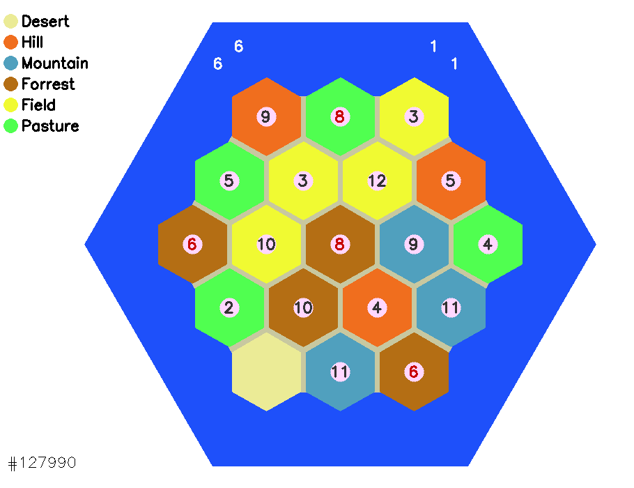
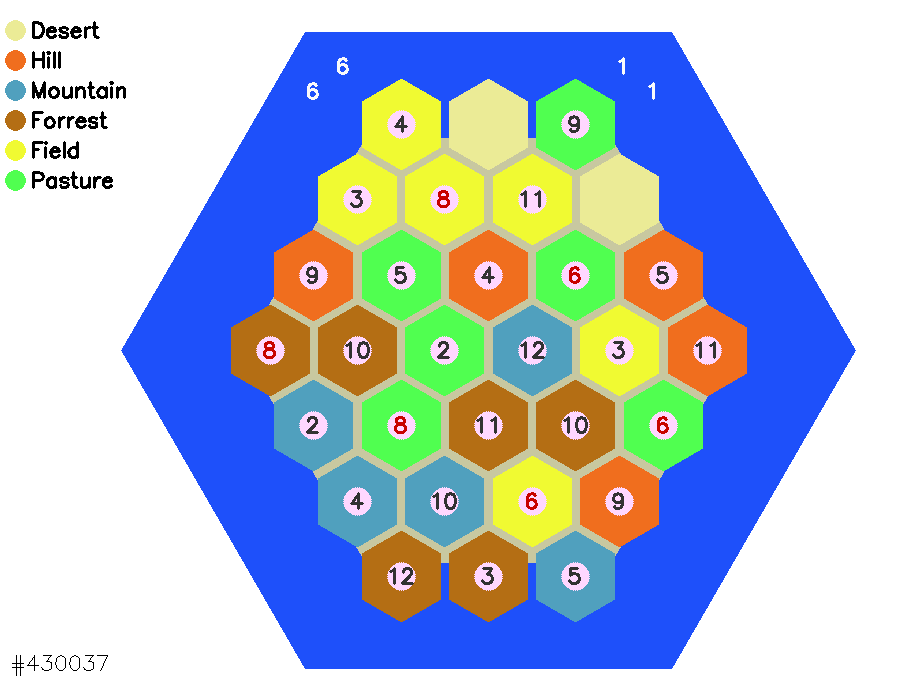

# CATAN-Ground-500K-Random  

  

Generates random grounds for CATAN board game and its extension version.  
-It generates 500K random CATAN grounds,  
-500K could be customized,  
-CATAN or its extension could be generated,  
-Optimized version is developed,  
## A sample of CATAN ground  
  


## One sample for the extension of CATAN  

  
The rule is no red number should be in the neighborhood of another red number.  
The original color used for "Forests" in CATAN is "Forest green" but I changed it to the color of woods.  
\
The function "polygon" presented below is a recursive function to draw and fill polygons with arbitrary number of sides. The length of sides, rotation degree, center of the polygon and a color to fill it are other inputs of this function. "polygon" is the graphical core of this project.  
```python
def polygon(image,c,side,edges,rotate,fill,color=[50,50,50]):
    """
    Recursive Algorithm
    Input: (image,center of polygon, length of each side, number of edges, color of edges,
            rotation of object as a factor of alpha, fill or empty inside, color of filling)
            
    Output: image including the filled polygon
    """
    def poly_skin(image,c,side,edges,color,rotate):
        """
        Input: (image,center of polygon, length of each side, number of edges, color of edges,
            rotation of object as a factor of alpha)
           
        Output: image including the polygon
        """
        alpha = 2.0*pi/edges
        beta = alpha*float(rotate)
        r = side/(2.0*sin(alpha/2.0))
        nodes = np_zeros((edges,2))
        for i in xrange(edges):
            nodes[i,:]=np_array([int(c[0]+r*sin(i*alpha+alpha/2.0+beta)+0.5),int(c[1]+r*cos(i*alpha+alpha/2.0+beta)+0.5)])
        nodes = nodes.astype('uint32')
        #for i in xrange(edges):
        #    cv2_circle(image,(nodes[i,0],nodes[i,1]),1,color1,1)
        for i in xrange(edges):
            cv2_line(image,(nodes[edges-i-1,0],nodes[edges-i-1,1]),(nodes[edges-i-2,0],nodes[edges-i-2,1]),color,2)
        return image,side
    if side < fill or fill < 0:
        image,small_side = poly_skin(image,c,side,edges,color,rotate)
        return image,small_side
    else:
        image,small_side = poly_skin(image,c,side,edges,color,rotate)
        return polygon(image,c,side-2,edges,rotate,fill,color)
```
Here you can find a link to [one million samples](https://drive.google.com/open?id=1nvbRNj7dBDScmpWcwMDG30If-EE-oq2J) of CATAN and the extension (500K + 500K) together.  

